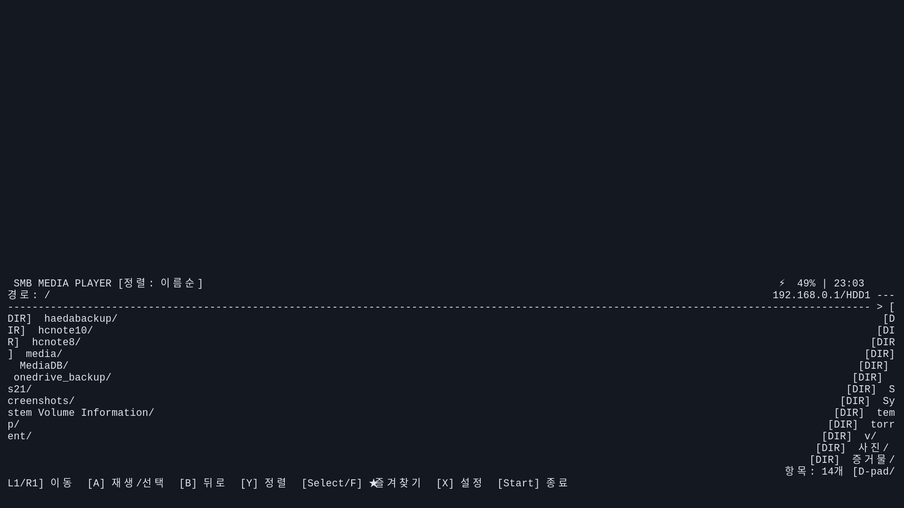

# SMB Media Player for ROCKNIX (RG VITA PRO)


락닉스(ROCKNIX) 구동 기기(RG VITA PRO 등)에서 NAS나 공유기(ipTIME/ASUS 등)의 SMB 공유 폴더에 접속하여 고화질 영상을 스트리밍 감상할 수 있는 Curses 기반 미디어 플레이어 포트(Port)입니다.



---

## 🚀 주요 기능

* **에뮬레이션스테이션 [Ports] 메뉴 완벽 통합**: 기기 부팅 후 Ports 메뉴에서 바로 실행.
* **FUSE(rclone) 기반 무손실 SMB 마운트**: 네트워크 지연 없이 즉시 폴더 탐색 및 스트리밍.
* **1080p 하드웨어 가속 (`mpv`)**: Rockchip RK3576 하드웨어 디코딩을 통한 1080p/4K 부드러운 재생.
* **Wayland & Foot 터미널 환경 최적화**: 한글 자모 및 글자 폭 자동 계산, 깔끔한 Curses UI.
* **게임패드 조작 지원 (`gptokeyb`)**:
  * **탐색 모드**:
    * `D-pad 상/하`: 항목 이동
    * `L1 / R1`: 빠른 페이지 스크롤
    * `A`: 재생 / 폴더 진입
    * `B`: 상위 폴더로 이동 / 취소
    * `Y`: 이름순 / 최신순 정렬 변경
    * `Select` 또는 `F`: 즐겨찾기 추가/해제
    * `X`: SMB 접속 설정 및 마운트 테스트
    * `Start` 또는 `Q`: 플레이어 종료 다이얼로그
  * **재생 모드 (`mpv`)**:
    * `D-pad 좌/우`: 10초 앞/뒤 탐색
    * `L1 / R1`: 60초 앞/뒤 탐색
    * `D-pad 상/하`: 볼륨 조절
    * `A` / `Start`: 일시정지 / 재생
    * `X`: 자막 트랙 변경
    * `Y`: 오디오 트랙 변경
    * `B` / `Select`: 재생 종료 후 파일 목록 복귀
* **자동 이어보기(Resume Playback)**: 시청하던 영상 위치를 자동 기억하여 다음 실행 시 이어서 재생.

---

## 📥 설치 방법 (기기 사용자)

1. [Releases](../../releases) 페이지에서 최신 `smb-player-rocknix.zip`을 다운로드합니다.
2. 압축을 풀면 나오는 파일들을 기기 SD 카드의 Ports 경로에 복사합니다:
   ```text
   /storage/roms/ports/
   ├── SMB Media Player.sh
   └── smb-player/
       ├── main.py
       ├── run_player.sh
       ├── smb_mount.sh
       ├── input.conf
       ├── smb.gptk
       └── config.json
   ```
3. `smb-player/config.json`을 열어 사용자 환경에 맞게 SMB IP와 계정 정보를 수정합니다 (또는 기기 UI 실행 후 `X` 버튼을 눌러 직접 설정 가능).
4. 기기의 **Ports** 목록에서 **SMB Media Player**를 실행합니다.

---

## ⚙️ 설정 (`config.json`)

`config.example.json`을 복사하여 `config.json`을 생성할 수 있습니다:

```json
{
  "smb_host": "192.168.0.1",
  "smb_port": 445,
  "smb_share": "HDD1",
  "smb_user": "username",
  "smb_pass": "password",
  "mount_point": "/storage/smb_player_mount"
}
```

* **기기 UI에서 직접 설정**: 앱 실행 후 `X` 버튼을 눌러 아이디/비밀번호를 입력하고 [연결 테스트 및 마운트]를 선택하면 됩니다.
* **PC에서 Wi-Fi 1-Click 배포**: `deploy.sh`를 통해 기기로 바로 전송 가능합니다.

---

## 🛠️ 개발 및 빌드 (`pnpm`)

이 프로젝트는 Node.js / `pnpm` 빌드 시스템을 사용하여 검증 및 패키징을 수행합니다.

### 요구 사항
* Node.js >= 18
* pnpm

### 명령어

```bash
# 종속성 설치
pnpm install

# 자동화 검증 테스트 (버전 규칙, 필수 파일, 개인정보 노출 검사)
pnpm test

# 배포용 아티팩트 및 zip 패키지 생성 (dist/)
pnpm run build

# ROCKNIX 기기로 원격 Wi-Fi 배포
pnpm run deploy 192.168.0.77
```

---

## 📄 라이선스

MIT License
